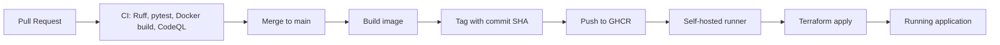

# KTH Course Reviews

A small Flask and SQLite web application for anonymous KTH course reviews.

The application is intentionally simple so the project can focus on a complete DevOps workflow: pull requests, CI, container builds, security automation, Infrastructure as Code, and automated deployment.

## Architecture

The application runs as a Docker container.

- Flask serves the web application on port 8000.
- SQLite stores reviews in `/data/reviews.db`.
- A Docker volume persists the database independently of the application container.
- Terraform manages the Docker network, volume, image, and container.
- GitHub Actions provides CI and CD.
- Docker images are stored in GitHub Container Registry.

Deployment flow:



## Local Development

Requirements:

- Python 3.13
- Docker
- Terraform

Install the Python dependencies:

```bash
python3 -m venv .venv
source .venv/bin/activate
pip install -r requirements-dev.txt
```

Run the tests:

```bash
pytest
```

Run the linter and formatting checks:

```bash
ruff check .
ruff format --check .
```

## Docker

Build the image:

```bash
docker build -t course-reviews:local .
```

Run the container with a persistent Docker volume:

```bash
docker volume create course-reviews-db

docker run --rm \
  -p 8000:8000 \
  -v course-reviews-db:/data \
  course-reviews:local
```

The application is then available at:

```text
http://localhost:8000
```

## Infrastructure as Code

Terraform defines:

- the Docker network,
- the persistent SQLite volume,
- the application image,
- the application container.

To deploy locally:

```bash
cd terraform
terraform init
terraform apply
```

The Docker image can also be selected with the `image` variable:

```bash
terraform apply -var="image=course-reviews:local"
```

## Continuous Integration

Every pull request runs on a GitHub-hosted runner and performs:

- Ruff linting
- Ruff formatting validation
- pytest
- Docker image build
- CodeQL analysis

The main branch is intended to require these checks before changes can be merged.

## Continuous Deployment

A push to `main` triggers the deployment workflow.

The workflow:

1. builds the Docker image,
2. tags it with the Git commit SHA,
3. pushes the image to GitHub Container Registry,
4. runs the deployment job on a self-hosted runner,
5. passes the immutable image tag to Terraform,
6. runs `terraform apply`.

The self-hosted runner is used only for trusted deployment code from `main`. Pull request code runs on GitHub-hosted runners.

## Security and Quality Automation

The repository uses:

- CodeQL for static security analysis.
- Dependabot for Python, GitHub Actions, Docker, and Terraform dependencies.
- Ruff for code quality and formatting.
- pytest for automated tests.

## AI-Assisted Development

The use of AI-assisted tools during development will be documented in the final project report, including what they were used for and how suggestions were reviewed and verified.

## Limitations

This setup is intentionally small and suitable for a course project.

Important limitations include:

- SQLite is not intended for horizontally scaled application replicas.
- Terraform state is stored locally on the self-hosted deployment runner.
- Deployment depends on a single self-hosted machine.
- A production system would normally use a remote Terraform backend with locking and backups.
- A public repository with a self-hosted runner requires careful separation between untrusted pull request workflows and trusted deployment workflows.
